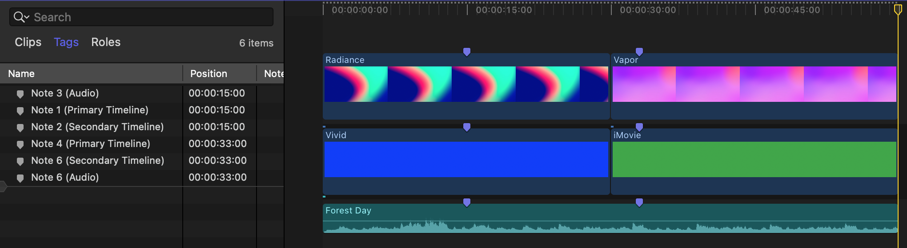
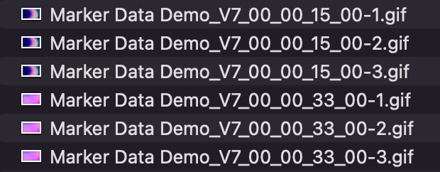
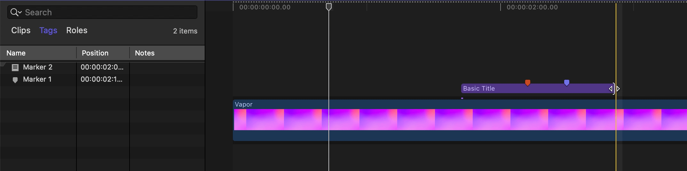

# Frequently Asked Questions

## What kind of timelines are supported in Marker Data?

**Marker Data** facilitates extraction from any conceivable timeline such as Projects and Compound Clips.

## What distinguishes extraction through the Share Destination from extraction via the Workflow Extension?

Extraction through the [Share Destination](/user-guide/share-destination) encompasses both Marker metadata and images, whereas extraction via the [Workflow Extension](/user-guide/workflow-extension/#extract) is limited to Marker metadata and does not include images.

## What happens when Marker collision occurs?

In instances where Markers coincide, **Marker Data** will adeptly rectify any conflicts arising from overlapping Marker ID such as Timecode, Name, or Notes.



**Marker Data** will create unique Marker IDs through an automated process of appending a numerical suffix to both the Marker ID and the Image Filename.




## What happens when Markers are situated within a Nested Compound, Multicam and synchronised clips?

**Marker Data** is intentionally configured to disregard any markers outside the primary active timeline. This deliberate choice is particularly pertinent in scenarios involving Compound Clips, where the potential for numerous nested structures exists. Parsing markers within each nested Compound Clip could introduce undue complexity.

Should you wish to extract markers from within a Compound Clip, a straightforward approach involves double-clicking the specific Compound Clip and exporting its associated timeline. In doing so, any markers nested within that particular Compound Clip's timeline will be excluded from consideration by **Marker Data**.

## What behavioural logic arise in the event when Markers are intentionally obscured by trimmed clips?



Employing a WYSIWYG methodology, Marker Data adopts an automated process wherein markers obscured within the timeline due to trimmed clips are inherently excluded.

## To what extent does Marker Data supersede the functionality of FCPXImageExporter?

**FCPXImageExporter** singularly focuses on the extraction of static images from source clips delineated by markers. This process, however, intentionally overlooks any post-effects and titles applied at both the timeline and individual clip levels.

In contrast, **Marker Data** adopts a comprehensive strategy by harnessing the output of the rendered timeline, alongside its associated FCPXML, to generate thumbnails encompassing both stills and GIFs. Additionally, the utilisation of a `.csv`, `.tsv` or `.json` format contributes to the creation of an all-encompassing Data Set.

Comparison matrix between **Marker Data** and **FCPXImageExporter.**

Features   | Marker Data | FCPXImageExporter
:---:   | :---: | :---:
Speed | Faster*  | Fast
Utilises Source Clips | No | Yes
RAW Files| Yes** | No
Effects, Titles & Transitions | Yes** | No
Creates .json Data Set | Yes | No
Creates .csv Data Set | Yes | No
Creates GIFs | Yes | No
Burn-Ins of Labels | Yes | No
Cost | Free & Open Source | Paid

**Performance depends on your Mac's hardware. With Apple Silicon M2 or higher, results are significantly faster.*
***Rendered Timeline*

## Does Marker Data replaces Producer's Best Friend?

No. Contrary to negation, **Producer’s Best Friend** serves as a complement rather than a replacement. It stands as the optimal application for crafting comprehensive spreadsheet reports compatible with platforms such as Numbers, Excel, Preview, and others. This versatile tool adeptly encompasses diverse elements, including Video Clips, Audio Clips, Titles, Generators, Markers, Keywords, Effects, and Transitions.

In contrast, **Marker Data** specialises solely in the extraction of information pertinent to markers and their associated metadata. It confines its focus to this specific domain, providing a nuanced and refined functionality distinct from the broader spectrum covered by Producer’s Best Friend.

## Does Marker Data replaces Creator's Best Friend?

Yes. While **Creator's Best Friend** is compatible with both Premiere and Final Cut Pro, **Marker Data** is exclusively designed for Final Cut Pro. Unlike **Creator's Best Friend**, **Marker Data** not only supports the extraction of Chapter Markers but also Regular Markers as chapters. Optimised for precise frame extraction, **Marker Data** can handle timelines with fewer than three markers and durations shorter than ten seconds.

## Can Marker Data's Data Set be used with other applications?

Yes. Within **Marker Data**, you have the option to export Data Set in two fundamental formats, namely `.csv` and `.tsv`. These exported Data Sets are located within `Export Destination` folder. Subsequently, you possess the flexibility to import either the `.csv` or the `.tsv` files into any compatible application of your choice.

## Will it be possible to extract and upload only specific column data?

**Marker Data** is designed to always extract and upload all column data. However, during the upload process, **Marker Data** will internally verify the table schema of the destination database (either Notion or Airtable) against the manifest `.json` file. If any column has been removed in Notion or Airtable, **Marker Data** will automatically skip uploading that column. Therefore, it is recommended to customise your database directly in Notion or Airtable rather than editing the .json file. Users can easily duplicate the provided [templates](/user-guide/databases/#notion-template) and modify it according to their preferences.

## What constitutes an optimal methodology for the nomenclature of Visual Effects Identification (VFX IDs) within a workflow?

Every project is different. But you can utilise this basic example.

``` VFX ID Example
XYZ701_150_010 - COOPER APPEARS NEAR PLANET SATURN
```

- **XYZ** is a 2-6 character code for the show or movie name
- **701** is a 3 digit episode number. For a standalone movie that is not episodic, any three digit number will suffice
- **150** is the scene number
- **010** is the shot number for the specific VFX shot within the scene
- **COOPER APPEARS NEAR PLANET SATURN** is the descriptive name of the shot

## To what extent does the compatibility of Marker Data with DaVinci Resolve, given its support for FCPXML?

Regrettably, despite the capacity to import and export FCPXMLs within **DaVinci Resolve**, the compatibility of Marker metadata is not integrated into the FCPXML format.

## What rationale underlies the utilisation of Notion v2 Tokens in lieu of official API provided by Notion?

The official API provided by Notion currently lacks the capability for direct image uploads and the seamless merging of page icons. Furthermore, it does not offer support for automatic linking or the creation of new entries in relation columns based on their respective values. The prospect of revisiting and updating our internal components will be considered as Notion continues to expand and enhance the functionality of their APIs.

## Could other database platforms be supported in the foreseeable future?

At present, our primary emphasis lies in the steadfast support and enhancement of integration capabilities with Notion and Airtable—two widely acclaimed platforms embraced by users and companies across the global Film and TV industry. The development of robust internal components for both [Notion](https://github.com/TheAcharya/csv2notion-neo) and [Airtable](https://github.com/TheAcharya/Airlift) has demanded a significant investment of time and effort.

Should you have specific use cases or preferences for other platforms, we encourage you to initiate a [discussion](https://github.com/TheAcharya/MarkerData/discussions). It is essential to note that the incorporation of additional platforms will be contingent upon the availability of compatible API libraries.

## Could Marker Data extract and convert Final Cut Pro's Marker metadata to another format?

Certainly, such an endeavour is within our purview. As we continue to refine and advance our Library, the augmentation of [Profiles](https://github.com/TheAcharya/MarkersExtractor/issues?q=is%3Aissue+is%3Aopen+label%3Aprofiles) is a definite consideration for future.

## Would it be possible to add a specific feature to Marker Data for a project I am currently working on?

If you require a specific feature for **Marker Data** that falls within the scope of the application, please contact us [here](https://theacharya.co/contact) for advice and a quote.

## Are you affiliated with Notion or Airtable?

We are not associated with, nor do we have any affiliation with, Notion or Airtable in any capacity.

## Is it possible to use Marker Data with the free plans of Notion or Airtable?

**Marker Data** can be seamlessly integrated with both the free plans of Notion and Airtable, as there are no technical constraints imposed by Marker Data on such usage. However, it is important to consider the limitations inherent to the free tiers of these platforms. Specifically, Notion's free plan restricts uploads to a maximum of 5MB per file, while Airtable's free plan imposes a limit of 1,000 records per base.

## Why is Marker Data only available on macOS Ventura or later?

**Marker Data** is compatible exclusively with macOS Ventura (version 13) or later due to Apple's policy of releasing new software features only for the latest version of their operating system. Although these features could technically work on older systems, Apple does not support such compatibility. This poses significant challenges for developers, who are then faced with the choice of either devising extensive workarounds or limiting support to newer OS versions.

As an independent developer, we have chosen to support only macOS Ventura and later versions to avoid the complexities and time-consuming nature of these workarounds. This decision is a matter of practicality and efficiency, not a reflection of a lack of effort or dedication.

## Does Marker Data support Intel-based Macs?

**Marker Data** has not been extensively tested on Intel-based Macs. Both our internal Notion and Airtable client binaries are built natively for the ARM64 architecture. While it is technically feasible to create universal binaries that support both Intel and Apple Silicon, doing so would necessitate incorporating additional dependency libraries, which could adversely affect upload performance. Starting with **Marker Data** version 1.1.0, application is exclusively build and optimised for Apple Silicon only.

## What is Marker Data's Privacy Policy?

**Marker Data** is designed to operate solely on your computer, without any collection of personal information. All processes and data manipulations occur locally, ensuring that your sensitive information remains confidential and secure. However, it's important to note that when you choose to upload data to platforms such as [Notion](https://www.notion.so/security), [Airtable](https://www.airtable.com/company/trust-and-security) or [Dropbox](https://www.dropbox.com/privacy), your information is subject to their respective privacy policies. We encourage you to read and familiarise yourself with their security & privacy policies to understand how they handle your data. Rest assured, our commitment to privacy means you can enjoy the benefits of our application without compromising your personal data.

## Why is Maker Data free?

The decision to offer **Marker Data** free of charge stems from a commitment to democratising access within the filmmaking community. Unlike many software solutions that impose subscription models or steep perpetual license fees, **Marker Data** prioritises inclusivity. Whether one is a burgeoning student filmmaker or a seasoned professional embarking on a feature project, **Marker Data** stands as a readily accessible resource. By removing financial barriers, the aim is to ensure that all individuals can benefit from its features without concern for monetary constraints. Moreover, by fostering a culture of contribution and support, users are encouraged to engage with **Marker Data** and, if they find value in its offerings can choose to contribute as sponsors. Ultimately, this approach not only facilitates seamless integration into Final Cut Pro workflows but also fosters a sense of community and collaboration within the filmmaking sphere. You can [sponsor](https://github.com/sponsors/TheAcharya) us if you find **Marker Data** useful or would like to see more features added.

