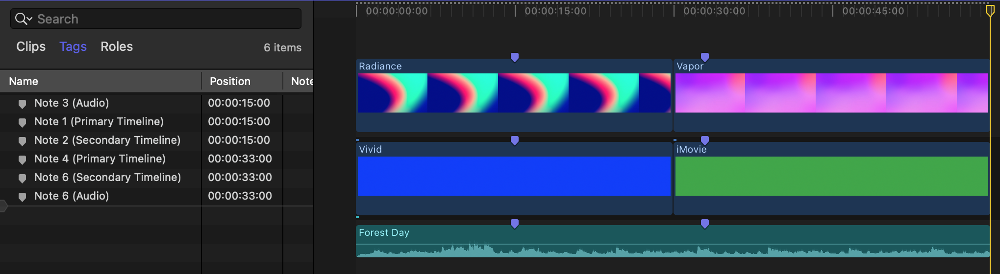
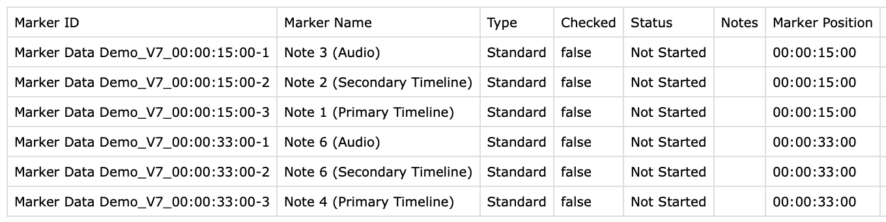
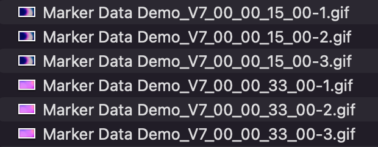
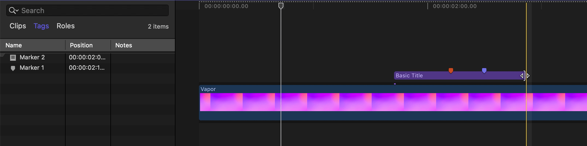
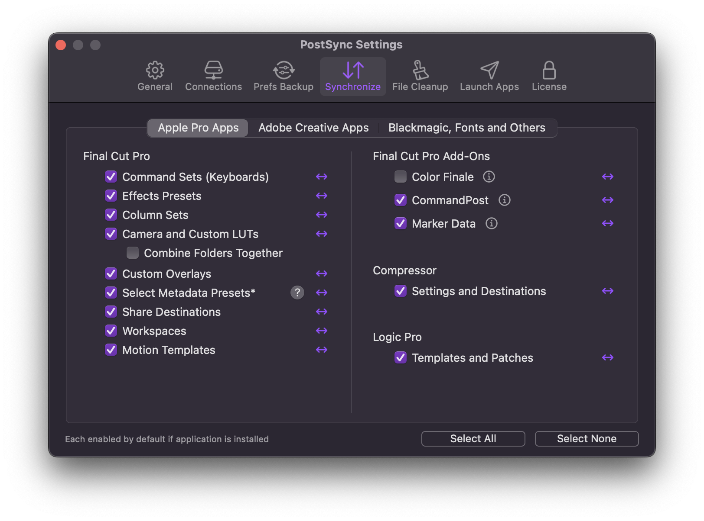

# Frequently Asked Questions

## What kind of timelines are supported in Marker Data?

**Marker Data** facilitates extraction from any conceivable timeline such as Projects and Compound Clips.

## What distinguishes extraction through the Share Destination from extraction via the Workflow Extension?

Extraction through the [Share Destination](/user-guide/share-destination) encompasses both Marker metadata and images, whereas extraction via the [Workflow Extension](/user-guide/workflow-extension/#extract) is limited to Marker metadata and does not include images.

## What happens when Marker collision occurs?

In instances where Markers coincide, **Marker Data** will adeptly rectify any conflicts arising from overlapping Marker ID such as Timecode, Name, or Notes.



**Marker Data** will create unique Marker IDs through an automated process of appending a numerical suffix to both the Marker ID and the Image Filename.





## What happens when Markers are situated within a Nested Compound, Multicam and synchronised clips?

**Marker Data** is intentionally configured to disregard any markers outside the primary active timeline. This deliberate choice is particularly pertinent in scenarios involving Compound Clips, where the potential for numerous nested structures exists. Parsing markers within each nested Compound Clip could introduce undue complexity.

Should you wish to extract markers from within a Compound Clip, a straightforward approach involves double-clicking the specific Compound Clip and exporting its associated timeline. In doing so, any markers nested within that particular Compound Clip's timeline will be excluded from consideration by **Marker Data**.

## What behavioural logic arise in the event when Markers are intentionally obscured by trimmed clips?



Employing a WYSIWYG methodology, Marker Data adopts an automated process wherein markers obscured within the timeline due to trimmed clips are inherently excluded.

## To what extent does Marker Data supersede the functionality of FCPXImageExporter?

**FCPXImageExporter** singularly focuses on the extraction of static images from source clips delineated by markers. This process, however, intentionally overlooks any post-effects and titles applied at both the timeline and individual clip levels.

In contrast, **Marker Data** adopts a comprehensive strategy by harnessing the output of the rendered timeline, alongside its associated FCPXML, to generate thumbnails encompassing both stills and GIFs. Additionally, the utilisation of a `.csv`, `.tsv` or `.json` format contributes to the creation of an all-encompassing Data Set.

Comparison matrix between **Marker Data** and **FCPXImageExporter.**

Features   | Marker Data | FCPXImageExporter
:---:   | :---: | :---:
Speed | Faster*  | Fast
Utilises Source Clips | No | Yes
RAW Files| Yes** | No
Effects, Titles & Transitions | Yes** | No
Creates .json Data Set | Yes | No
Creates .csv Data Set | Yes | No
Creates GIFs | Yes | No
Burn-Ins of Labels | Yes | No
Cost | Free & Open Source | Paid

**Performance depends on your Mac's hardware. With Apple Silicon M2 or higher, results are significantly faster.*
***Rendered Timeline*

## Does Marker Data replaces Producer's Best Friend?

No. Contrary to negation, **Producer’s Best Friend** serves as a complement rather than a replacement. It stands as the optimal application for crafting comprehensive spreadsheet reports compatible with platforms such as Numbers, Excel, Preview, and others. This versatile tool adeptly encompasses diverse elements, including Video Clips, Audio Clips, Titles, Generators, Markers, Keywords, Effects, and Transitions.

In contrast, **Marker Data** specialises solely in the extraction of information pertinent to markers and their associated metadata. It confines its focus to this specific domain, providing a nuanced and refined functionality distinct from the broader spectrum covered by Producer’s Best Friend.

## Does Marker Data replaces Creator's Best Friend?

Yes. While **Creator's Best Friend** is compatible with both Premiere and Final Cut Pro, **Marker Data** is exclusively designed for Final Cut Pro. Unlike **Creator's Best Friend**, **Marker Data** not only supports the extraction of Chapter Markers but also Regular Markers as chapters. Optimised for precise frame extraction, **Marker Data** can handle timelines with fewer than three markers and durations shorter than ten seconds.

## Can Marker Data's Data Set be used with other applications?

Yes. Within **Marker Data**, you have the option to export Data Set in two fundamental formats, namely `.csv` and `.tsv`. These exported Data Sets are located within `Export Destination` folder. Subsequently, you possess the flexibility to import either the `.csv` or the `.tsv` files into any compatible application of your choice.

## Will it be possible to extract and upload only specific column data?

**Marker Data** is designed to always extract and upload all column data. However, during the upload process, **Marker Data** will internally verify the table schema of the destination database (either Notion or Airtable) against the manifest `.json` file. If any column has been removed in Notion or Airtable, **Marker Data** will automatically skip uploading that column. Therefore, it is recommended to customise your database directly in Notion or Airtable rather than editing the .json file. Users can easily duplicate the provided [templates](/user-guide/databases/#notion-template) and modify it according to their preferences.

## What constitutes an optimal methodology for the nomenclature of Visual Effects Identification (VFX IDs) within a workflow?

Every project is different. But you can utilise this basic example.

``` VFX ID Example
XYZ701_150_010 - COOPER APPEARS NEAR PLANET SATURN
```

- **XYZ** is a 2-6 character code for the show or movie name
- **701** is a 3 digit episode number. For a standalone movie that is not episodic, any three digit number will suffice
- **150** is the scene number
- **010** is the shot number for the specific VFX shot within the scene
- **COOPER APPEARS NEAR PLANET SATURN** is the descriptive name of the shot

## To what extent does the compatibility of Marker Data with DaVinci Resolve, given its support for FCPXML?

Regrettably, despite the capacity to import and export FCPXMLs within **DaVinci Resolve**, the compatibility of Marker metadata is not integrated into the FCPXML format.

## Could other database platforms be supported in the foreseeable future?

No. At present, our primary emphasis lies in the steadfast support and enhancement of integration capabilities with Notion and Airtable—two widely acclaimed platforms embraced by users and companies across the global Film and TV industry. The development of robust internal components for both [Notion](https://github.com/TheAcharya/csv2notion-neo) and [Airtable](https://github.com/TheAcharya/Airlift) has demanded a significant investment of time and effort.

## Could Marker Data extract and convert Final Cut Pro's Marker metadata to another format?

Whilst this is technically feasible, our [Library](https://github.com/TheAcharya/MarkersExtractor) has reached a considered level of maturity and has consequently transitioned into [maintenance mode](https://en.wikipedia.org/wiki/Maintenance_mode). As such, we have no intention of introducing new features or profiles. Our ongoing commitment is limited to the resolution of defects and the provision of compatibility updates as and when required.

## Would it be possible to add a specific feature to Marker Data for a project I am currently working on?

With the release of **Marker Data** 2.0.0, we consider the application to have reached a definitive level of maturity. As such, we have no intention of introducing significant new features beyond routine maintenance and bug fixes. That said, should you have a particular enquiry, you are most welcome to contact us [here](https://theacharya.co/contact).

## Are you affiliated with Notion or Airtable?

We are not associated with, nor do we have any affiliation with, Notion or Airtable in any capacity.

## Is it possible to use Marker Data with the free plans of Notion or Airtable?

**Marker Data** can be seamlessly integrated with both the free plans of Notion and Airtable, as there are no technical constraints imposed by Marker Data on such usage. However, it is important to consider the limitations inherent to the free tiers of these platforms. Specifically, Notion's free plan restricts uploads to a maximum of 5MB per file, while Airtable's free plan imposes a limit of 1,000 records per base.

## Why is Marker Data only available on the latest macOS versions?

**Marker Data** is compatible exclusively with the current and preceding major release of macOS, owing to Apple's policy of restricting new software features and frameworks to their most recent operating system releases. Whilst these features may technically function on older systems, Apple provides no official support for such compatibility, which presents considerable challenges for developers who must then choose between implementing extensive workarounds or confining support to the most current OS versions.

As an independent developer, we have elected to support only the current and immediately preceding major release of macOS, so as to avoid the complexities and time-consuming nature of such workarounds. This is a matter of practicality and efficiency, and is in no way a reflection of any lack of effort or dedication on our part.

## Does Marker Data support Intel-based Macs?

No. Starting with **Marker Data** version 1.1.0, application is exclusively build and optimised for Apple Silicon only.

## Can iCloud Sync Be Integrated for Marker Data’s Configuration and Database Profiles?

While integrating iCloud Sync for **Marker Data**’s Configuration and Database Profiles is technically feasible, it falls outside the application's intended scope. Implementing such a feature would introduce additional complexities in maintenance and development.

Users can, however, manually back up their Configuration and Database Profiles to a preferred location as needed. For those requiring a more robust synchronisation solution, we recommend [PostSync](https://chrisroyfilms.com/postsync/), which fully supports **Marker Data**’s Configuration and Database Profiles.



## Is Marker Data safe to use even though it's not sandboxed?

Yes, **Marker Data** is safe. While it is not a sandboxed application, it has been code-signed and notarised by Apple’s notary service. This means the application has been checked and approved by Apple to be free of known malware. As long as you download **Marker Data** from our official [source](https://github.com/TheAcharya/MarkerData/releases), you can trust its integrity and security.

## Why isn’t Marker Data available on the Mac App Store?

**Marker Data** is coded in a way that is not compatible with the strict sandboxing requirements enforced by the Mac App Store. These restrictions would limit essential aspects of the app’s functionality. To preserve the full capabilities of **Marker Data**, we distribute it independently via our official GitHub repository.

## What is Marker Data's Privacy Policy?

**Marker Data** is designed to operate solely on your computer, without any collection of personal information. All processes and data manipulations occur locally, ensuring that your sensitive information remains confidential and secure. However, it's important to note that when you choose to upload data to platforms such as [Notion](https://www.notion.so/security), [Airtable](https://www.airtable.com/company/trust-and-security) or [Dropbox](https://www.dropbox.com/privacy), your information is subject to their respective privacy policies. We encourage you to read and familiarise yourself with their security & privacy policies to understand how they handle your data. Rest assured, our commitment to privacy means you can enjoy the benefits of our application without compromising your personal data.

## Why is Maker Data free?

The decision to offer **Marker Data** free of charge stems from a commitment to democratising access within the filmmaking community. Unlike many software solutions that impose subscription models or steep perpetual licence fees, **Marker Data** prioritises inclusivity. Whether one is a burgeoning student filmmaker or a seasoned professional embarking on a feature project, **Marker Data** stands as a readily accessible resource. By removing financial barriers, the aim is to ensure that all individuals may benefit from its features without concern for monetary constraints.

**Marker Data** holds a particular significance for us, as it was our first application developed for macOS. In its inception, it served as an invaluable exercise in acquainting ourselves with Apple's software development ecosystem and understanding the intricacies of building and maintaining a macOS application. Given this, we felt it only fitting to open-source the application, with the hope that it may serve as a useful reference for other developers who find themselves at a similar juncture in their journey.

By fostering a culture of contribution and support, users are encouraged to engage with **Marker Data** and, should they find value in its offerings, may choose to contribute as sponsors. Ultimately, this approach not only facilitates seamless integration into Final Cut Pro workflows but also fosters a sense of community and collaboration within the filmmaking sphere. You can [sponsor](https://github.com/sponsors/TheAcharya) us if you find **Marker Data** useful or would like to show your support.
