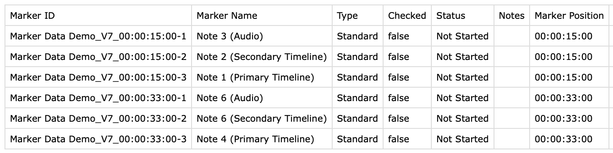

# Frequently Asked Questions

## What is the behaviour when Marker collision occurs?

When there are Markers at the same timecode position, **Marker Data** will automatically resolve the collision of ID (Timecode, Name or Notes).


**Marker Data** will create unique Marker ID by automatically appending a numerical suffix at the end of the Marker ID and Image Filename.




## What is the behaviour when Markers are located within Compound, Multicam and Synchronise Clips?

**Marker Data** will ignore all Markers that are not part of the main active timeline. This is by design. For example, Compound Clips can have an umpteen number of nested Compound Clips with each Compound clip. It would get complicated trying to parse the Markers within each nested Compound Clips.

If a user want so extract the markers from within the Compound Clip, that user would just double-click the particular Compound Clip and export its timeline. Any markers nested within that Compound Clip of the timeline would be ignored by the **Marker Data**.

## Does Marker Data replaces FCPXImageExporter?

Yes & No. Both **Marker Data** and **FCPXImageExporter** utilise different approach in solving a similar problem. **FCPXImageExporter** only extracts still images from source clips based on Makers. **FCPXImageExporter** completely ignores any post effects and titles applied to the timeline and individual clips. By contrast, Marker Data utilises both the output of the rendered timeline, and its accompanying FCPXML to derive all thumbnails (Stills or GIFs) and `.json` to create a complete Data Set.

Comparison matrix between **Marker Data** and **FCPXImageExporter.**

Features   | Marker Data | FCPXImageExporter
:---:   | :---: | :---:
Speed | Moderate to Fast*  | Fast
Utilises Source Clips | No | Yes
Utilises Rendered Timeline  | Yes | No
RAW Files| Yes** | No
Effects, Titles & Transitions | Yes** | No
Creates .csv Data Set | Yes | No
Creates GIFs | Yes | No
Burn-Ins of Labels | Yes | No
Cost | Free & Open Source | Paid

**Dependent on your Mac’s hardware. With Apple Silicon, you can get faster results.*
***Rendered Timeline*

## Does Marker Data replaces Producer's Best Friend?

No. In fact it complements it. **Producer’s Best Friend** is the best application for creating spreadsheet report (for Numbers, Excel, Preview, etc.) about the Video Clips, Audio Clips, Titles, Generators, Markers, Keywords, Effects, and Transitions. **Marker Data** only extracts information pertaining markers and its accompanying metadata. Nothing more.

## Can Marker Data's Data Set be used with other applications?

1. Yes.
2. All **Marker Data** files are stored in **Export Destination** folder.
3. In each sub folders, you will find the `*.csv` file with the accompanying images auto named.
4. You can import the `*.csv` to any application that accepts it.

## What is the appropriate workflow for naming VFX IDs?

Every project is different. But you can utilise this basic example.

``` VFX ID Example
XYZ701_150_010 - COOPER APPEARS NEAR PLANET SATURN
```

- **XYZ** is a 2-6 character code for the show or movie name
- **701** is a 3 digit episode number. For a standalone movie that is not episodic, any three digit number will suffice
- **150** is the scene number
- **010** is the shot number for the specific VFX shot within the scene
- **COOPER APPEARS NEAR PLANET SATURN** is the descriptive name of the shot

## Could Marker Data support DaVinci Resolve since it supports FCPXMLs?

No. Despite having the ability to import and export FCPXMLs from DaVinci Resolve, compatible Marker metadata is not added in the FCPXMLs.

## Why Notion v2 Token is used instead of Notion’s official API Connections?

Notion’s official API does not support direct upload and merging of images and page icons. It also does not support automatic linking or create new entries in relation columns based on their value. The day when Notion further opens up their APIs, we will look into updating our internal components.

## Will other database platforms be supported?

The current focus is to support and maintain Notion and Airtable integration. These two are the most popular platforms among users and companies in the Film and TV industry around the world. We took considerable amount of time in building our internal components for both [Notion](https://github.com/TheAcharya/csv2notion-neo){target=“_blank”} and [Airtable](https://github.com/TheAcharya/Airlift){target=“_blank”}.

In the database/productivity space, new platforms (both commercial and open-source) such as [Coda](https://coda.io/){target=“_blank”}, [Baserow](https://baserow.io/){target=“_blank”}, [AppFlowy](https://appflowy.io/){target=“_blank”} and Microsoft’s [Loop](https://loop.microsoft.com/learn){target=“_blank”} are on the rise.

If you have a particular use case and platform in mind, please start a [discussion](https://github.com/TheAcharya/MarkerData/discussions){target=“_blank”}. However, the addition of platforms will be subjected to the availability of API libraries.

## Could Marker Data extract and convert Final Cut Pro's Marker metadata to another format?

Yes, it is possible. We will definitely add more [Profiles](https://github.com/TheAcharya/MarkersExtractor/issues?q=is%3Aissue+is%3Aopen+label%3Aprofiles){target=“_blank”} as we improve and update our Library over time.

## Is Marker Data free to use?

Yes. But you can [sponsor](https://github.com/sponsors/TheAcharya){target=“_blank”} us if you find **Marker Data** useful.

